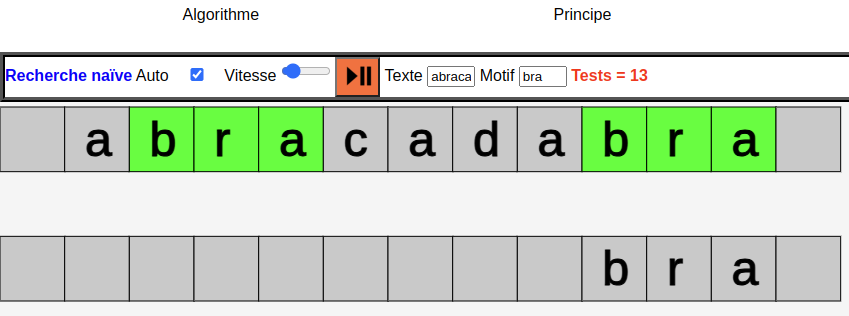
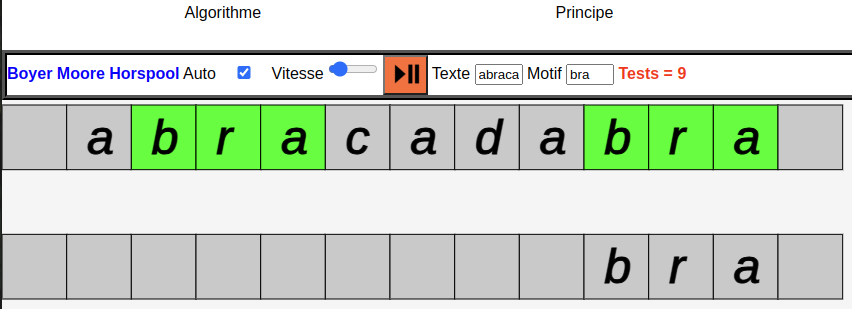

Recherche textuelle
====================

# Recherche naïve

!!! question "À faire"
    Àprès avoir visionné l'animation proposée, donner un algorithme qui permet une recherche naïve d'un `motif` dans une chaîne `texte`, renvoyant une liste des indices de coïncidence.  

    

    Proposer une implémentation en python et discuter de l'efficacité de l'algorithme.

```
Algorithme Recherche_naive

Entrées: texte de longueur n, motif de longueur m (chaînes de caractères)
Sortie: liste des indices de coïncidence de motif dans texte

Variables: trouve booléen, indice liste

indice <- liste vide
Pour i allant de 0 à n-m
    trouve = VRAI
    Pour j allant de 0 à m-1
        si texte[i+j] != motif[j]
            trouve = FAUX
            Quitter la boucle
    si trouve = VRAI
        Sauvegarder i dans indice
Renvoyer indice
```

Dans le pire des cas (*probablement rare*), on fera $(n-m+1)\times m$ comparaisons de caractères, soit une complexité temporelle en $\mathcal{O}(nm)$.


```python
def recherche_naive(texte, motif):
    """ renvoie la liste des indices d'occurrence de motif dans texte"""

    indice = []
    n, m = len(texte), len(motif)
    for i in range(n-m+1):
        trouve = True
        for j in range(m):
            if texte[i+j] != motif[j]:
                trouve = False
                break
        if trouve:
            indice.append(i)
    return indice
```


```python
recherche_naive("abracadabra", "bra")
```


    [1, 8]


# Amélioration: algorithme de Boyer Moore Horspool

L'algorithme naïf a pour défaut de tester la présence du motif pour tous les décalage $i$ possibles. 

!!! question "À faire"
    Observer l'animation relative à l'algorithme de Boyer Moore Horspool.  
    
    
    Quelle amélioration essentielle est apportée? Proposer une fonction qui permet de calculer le décalage amélioré.

Dans ce cas, l'efficacité est améliorée: on effectue moins de tests. Cela est dû au fait que le décalage n'est plus forcément de 1.  

On note par ailleurs, que la recherche de correspondance:  

* se fait de la droite vers la gauche;
* fait intervenir une table de décalage (*dite table de Horspool*) qui donne du décalage à appliquer au motif lors d'une discordance.

L'algorithme de construction de la table de Horspool est le suivant:  

```
+-------------------------+
|Algorithme table_decalage|
+-------------------------+
Entrée: 'motif', chaîne de caractère
Sortie: dictionnaire 'table' (tableau associatif) ayant des paires (caractère: décalage)

    Initialiser tous les éléments du tableau avec la longueur m du motif
    Pour i allant de 0 à m-2:
        table[i] = m - 1 - i
    Renvoyer table
```

L'implémentation en python ne pose aucune difficulté, de même que le test associé.


```python
def decalage(motif):
    """
    Construit la table de Horspool correspondant à 'motif'.
    """
    # Habituellement cette table est indexée par les caractères de l'alphabet utilisé.
    # On peut commencer à partir du code ASCII 32 (caractères imprimables)
    m = len(motif)
    table_decalage = {chr(i): m for i in range(32, 256)}
    for i in range(len(motif) - 1):
        table_decalage[motif[i]] = len(motif) - 1 - i
    return table_decalage
```


```python
for caractere, decalage_ in decalage("banane").items():
    if caractere in "banane":
        print(caractere, decalage_)
print('x', decalage('banane')['x'])
```

    a 2
    b 5
    e 6
    n 1
    x 6


L'algorithme de Boyer Moore Horspool peut être décrit avec le pseudo code suivant:  

```
+-----------------------------------+
| Algorithme de Boyer Moore Horspool|
+-----------------------------------+
Entrées: texte, motif
Sortie: liste des indices de coïncidence

    table <- table de décalage de Horspool de motif /* prétraitement */
    indices <- liste vide
    m <- longueur de motif
    n <- longueur de texte
    i <- m-1 /* index pointant la fin du motif */
    Tant que i <= n-1
        k <- 0 /* nombre de caractères coïncidents */
        Tant que k <= m-1 ET motif[m-1-k] = texte[i-k]
            k <- k+1
        Si k = m /* Coïncidence */
            Sauvegarder i-m+1 dans indices
            i <- i+1
        Sinon
            i <- i + table[texte[i]]
    Renvoyer indices
```
L'implémentation en python ne pose pas de problème particulier.        

!!! question "À faire"
    Implémenter cet algorithme en python. Tester en cherchant la chaîne `Julien tremblait` dans `le rouge et le noir` de Stendhal. Discuter des performances.


```python
def bmh(texte, motif):
    table = decalage(motif)
    indices = []
    m, n = len(motif), len(texte)
    i = m-1
    while i <= n-1:
        k = 0
        while k <= m-1 and motif[m-1-k] == texte[i-k]:
            k = k+1
        if k == m:
            indices.append(i-m+1)
            i = i+1
        else:
            i = i + table[texte[i]]
    return indices
```


```python
bmh("abracadabra", "bra")
```


    [1, 8]


```python
fichier = open('LeRougeEtLeNoir.txt','r')
stendhal = fichier.read()
fichier.close()
stendhal = stendhal.replace('\n', ' ')
```


```python
# Discussion
```

# Algorithme de Boyer-Moore
